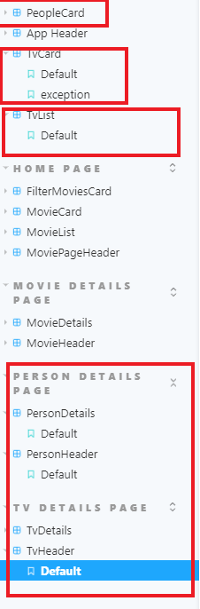
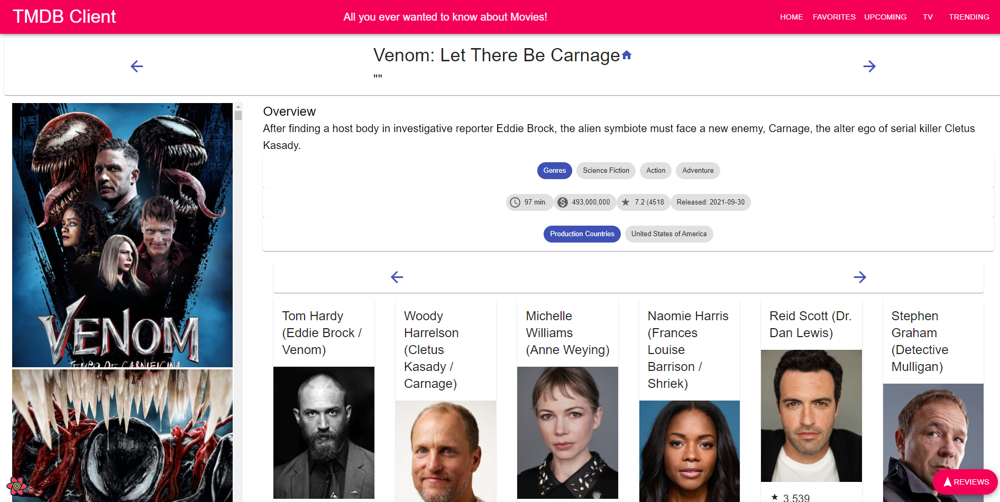
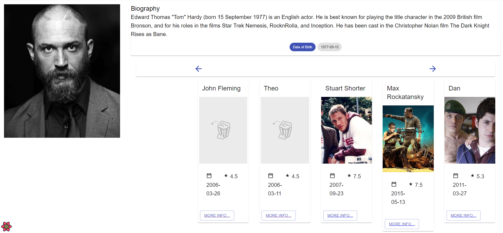
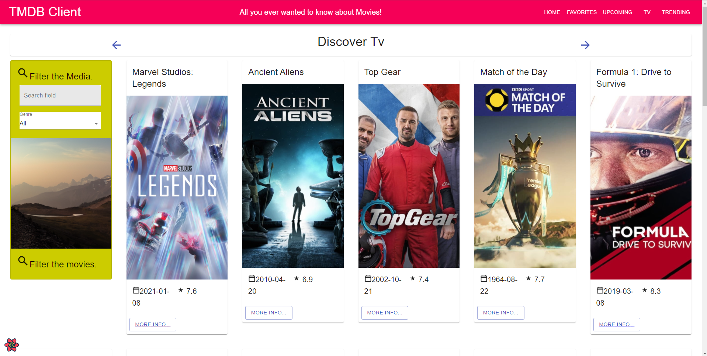
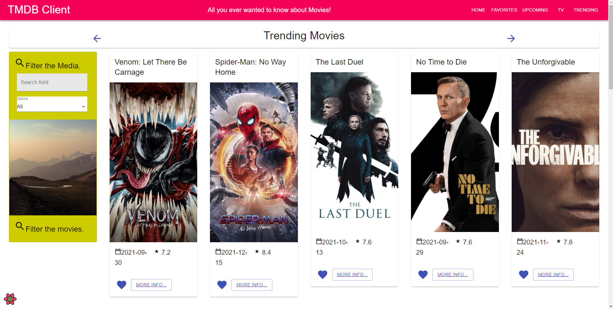

# Assignment 1 - ReactJS app.

Name: Tommy Dalton

## Overview.

This repo is for assignment 1 Web App Development. It contains a movies app which queries the TMDB database to get data to display to the user.

### Features.

 
+ Feature 1 See new Movies.
+ Feature 2 See new Tv Shows
+ Feature 3 Add Movies to your favourites list.
+ Feature 4 See the acting cast of each movie.
+ Feature 5 See what movies specific actors have starred in.
+ Feature 6 See whats Trending in the Trending Tab.

## Setup requirements.

Installiong the node modules necessary to run it.

## API endpoints.

e.g.
+ Discover list of movies - discover/movie
+ Movie details - movie/:id
+ Movie genres = /genre/movie/list
+ Discover list of Tv shows - discover/tv
+ Get Tv Show details - tv/:id
+ Get Trending Movies = /trending/movie/week
+ Get Tv Show Images = /tv/:id/images
+ Get Tv Genres = /genre/tv/list
+ Get Movie Images = /movie/:id?images
+ Get Movie Reviews = /movie/:id/reviews
+ Get Upcoming movies = /movie/upcoming
+ Get Credits = /movie/:id?credits
+ Get Person = /person/:id
+ Get Person Movie Credits = /person/:id/movie_credits

## App Design.

### Component catalogue.

### UI Design.

[ Insert screenshots of the __new/modified app pages__ you developed (and modified existing pages), Include an appropriate caption for each one (see example below).

>Below the movies details i have added the list of its cast members to the bottom. Each cast member can be interacted with for more info.

>Accessed through a movie the actors page lists some info on the actor and some of the roles they have played in other movies below. These movies can be accessed by clicking on more info.

>Lists Tv shows using TMDB discover tv shows query.

> Lists Trending Movies using TMDB Trending query

### Routing.

+ /Tv - For the Tv Shows
+ /Tv/:id - For a specific tv shows details
+ /Person/:id - For a specific actors details
+ /trending - For trending Movies

## Independent learning (If relevant).

+ Nothing of note